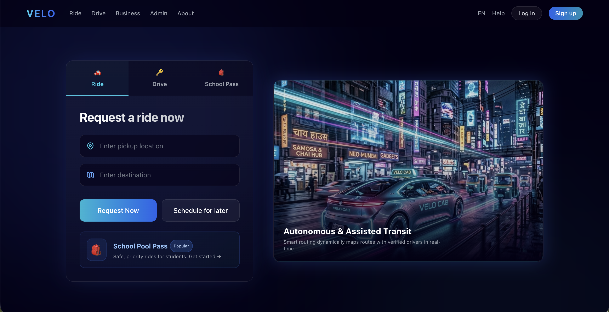
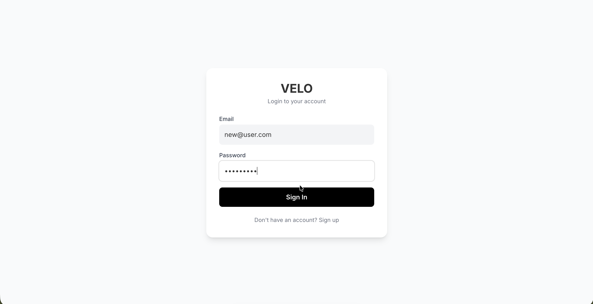
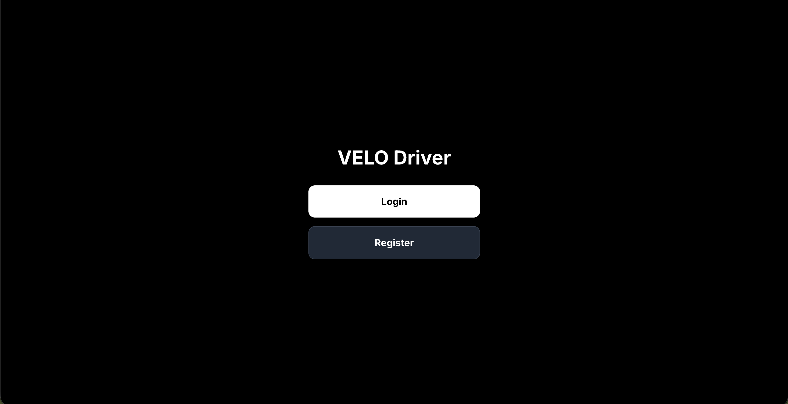
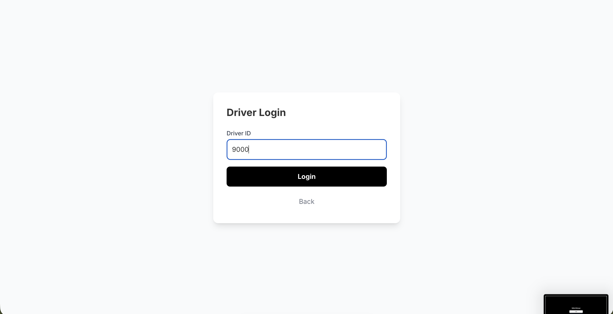
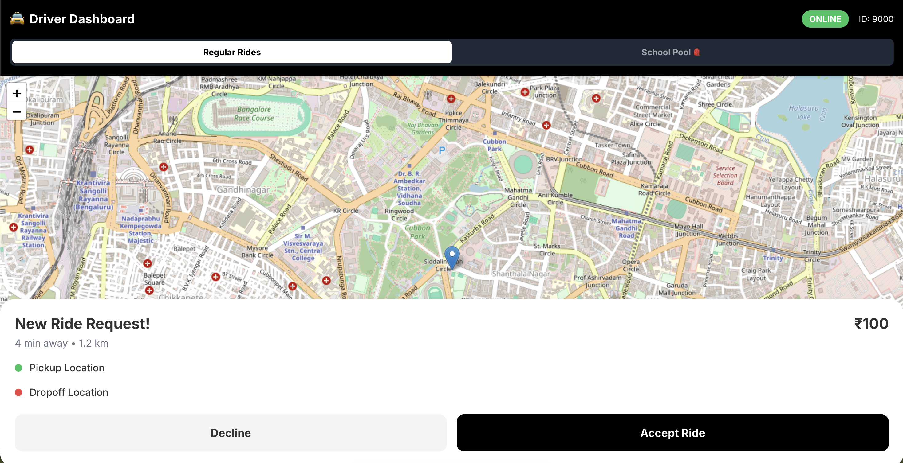
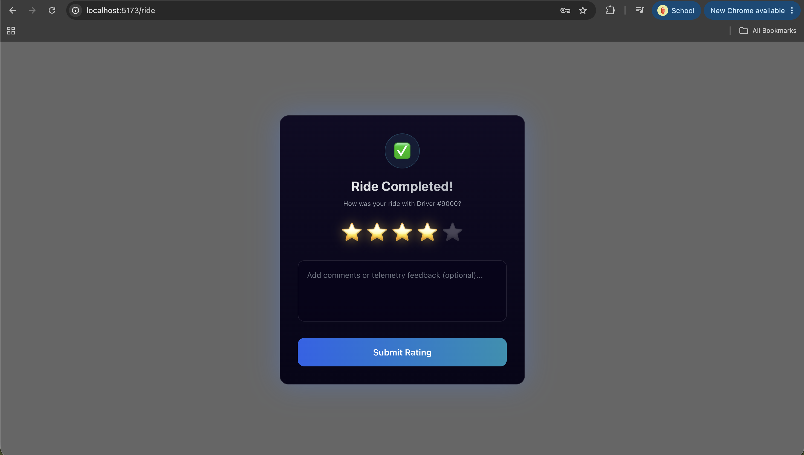

# VELO (Mini Uber)

A comprehensive ride-hailing platform built with modern technologies, featuring specialized services like the **School Pool Pass**.

## Key Features

### School Pool Pass (Special Feature)
A dedicated subscription service for safe student transportation.
-   **Safe Drivers**: Only verified "Safe Drivers" are assigned to school routes.
-   **Subscriptions**: Monthly, Quarterly, or Annual passes.
-   **Live Tracking**: Parents can track their child's ride in real-time.
-   **OTP Verification**: Secure pickup and drop-off confirmation.
-   **Optimized Routing**: efficient route planning for picking up multiple students.

### Core Ride Hailing
-   **Real-time Booking**: Book Auto or Moto rides instantly.
-   **Interactive Maps**: Visual route plotting using OSRM and Leaflet.
-   **Live Driver Tracking**: See drivers moving on the map near you.
-   **Authentication**: Secure Login and Signup for Riders and Drivers using JWT.

---

## Tech Stack

### Frontend
-   **Framework**: React (Vite)
-   **Language**: TypeScript
-   **Styling**: TailwindCSS
-   **Maps**: React Leaflet (OpenStreetMap)
-   **Routing**: React Router DOM

### Backend
-   **Framework**: FastAPI (Python)
-   **Database**: PostgreSQL
-   **ORM**: SQLAlchemy
-   **Authentication**: Python-JOSE (JWT), Passlib (Bcrypt)
-   **Routing Engine**: OSRM (Open Source Routing Machine) API

---

## Prerequisites

Before running the project, ensure you have the following installed:

1.  **Node.js** (v16 or higher) - [Download](https://nodejs.org/)
2.  **Python** (3.9 or higher) - [Download](https://www.python.org/)
3.  **PostgreSQL** (running locally or cloud) - [Download](https://www.postgresql.org/)

---

## Getting Started

### 1. Backend Setup

```bash
cd serverapp

# Create virtual environment (optional but recommended)
python -m venv .venv
source .venv/bin/activate  # Windows: .venv\Scripts\activate

# Install dependencies
pip install -r requirements.txt
pip install passlib "python-jose[cryptography]"

# Configure Database
# Create a .env file or update database/connections.py with your Postgres credentials

# Run Server
python server.py
# Server runs at http://localhost:8000
```

### 2. Frontend Setup

```bash
cd frontend

# Install dependencies
npm install

# Run Development Server
npm run dev
# App runs at http://localhost:5173
```

## Credentials

-   **Rider Login**: Create a new account via the Signup page.
-   **Driver Login**: Use Driver IDs like `8100`, `8101` (Auto-registered).
  ##    🌐 Live Deployment

### Frontend

velo-59kj6zssq-bhardwajgourang123-9151s-projects.vercel.app

### Backend

https://velo-main-server.onrender.com

### API Documentation

https://velo-main-server.onrender.com/docs

---
# 🚀 Complete Ride Flow

The following screenshots demonstrate the complete end-to-end workflow of VELO, from user authentication to ride completion.

---

## 🏠 1. Home Screen

The landing page where users choose to continue as a Rider or Driver.



---

## 👤 2. Rider Login

The rider authenticates before requesting a ride.



---

## 🚗 3. Driver Login

Drivers log in to begin accepting rides.



---

## 🪪 4. Driver Verification

The driver enters their Driver ID for authentication.



---

## 🟢 5. Driver Goes Online

Once verified, the driver becomes available to receive ride requests.


---

## 📍 6. Rider Selects Pickup & Destination

The rider selects pickup and destination addresses.


---

## 🚕 7. Driver Assigned

The backend matches the rider with the nearest available driver.


---

## 📲 8. Ride Request Received

The driver receives the ride request with passenger details.



---

## 🔐 9. OTP Verification

For security, the rider provides an OTP which the driver verifies before starting the trip.


---

## ▶️ 10. Ride Started

Once OTP verification succeeds, the ride officially begins.

### Driver's View

.png)

### Rider's View

.png)

---

## ⭐ 11. Ride Completed

After reaching the destination, the rider rates the trip.



---

Built with ❤️ by Team VELO.
